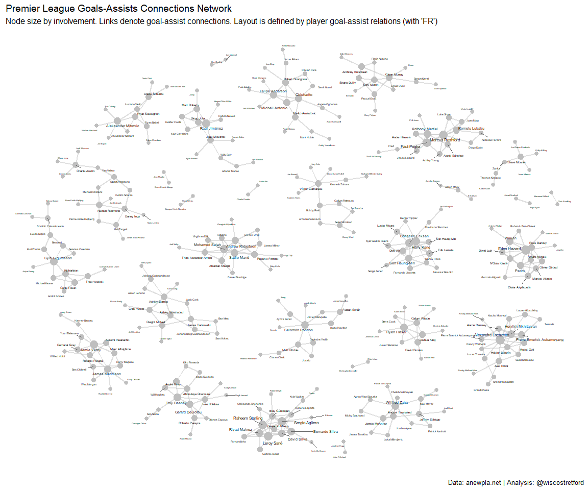

# Scraping and exploring Premier League goal-assist connections

Here we are interested in exploring goal-assists connections in the Premier League. There aren't too many data sources that link goalscorers and assisters, so here we're using the live FPL text stream from anewpla.net. This source has certain limitations, but provides generally good coverage.

First, we load the libraries we'll need along the way:


```r
library(fplscrapR)
library(dplyr)
library(rvest)
library(stringr)
```

Next we find the number and ids of finished games (with fplscrapR) to loop through on the anewpla FPL site:


```r
gamelist <- get_game_list() %>% filter(finished == "TRUE")
```

Next we define an empty df to save our looped elements in, and set up a loop to save our scraped goalscorer and assister data


```r
gas <- data.frame()

for (i in 1:nrow(gamelist)){

## with rvest, read the url and load the specific text element containing the scorer and assister data 
  url <- read_html(paste("https://www.anewpla.net/fpl/live/",gamelist$id[i],"/",sep=""))  

  my_ul <- url %>% html_nodes(xpath="//*[@id='container']/table/tr/td[4]") %>% html_text()
  
  ## some pages are empty, for some reason, so if the ul (list) length is 0, we do nothing from here; if there is content, we split the text by digits (signifying minutes a particular event happened)
  ifelse(length(my_ul) == 0,"",{
  
  my_ul_df <- data.frame(str_split(my_ul,"[:digit:]{2}"),stringsAsFactors=F)
  
  colnames(my_ul_df) <- "text"})
  
  ## we filter for the event texts where there was a goal
  my_ul_goals <- my_ul_df %>% filter(grepl("Goal!",text))
  
  ## now we split the goal text and define a data frame containing a goalscorer and an assister (where available) using regular expressions
  ifelse(
    nrow(my_ul_goals)==0,
    "",
    {
    my_ul_goals <- str_split(my_ul_goals$text,"\\.|\\(")
  
    ga <- data.frame()
  
    for (j in 1:length(my_ul_goals)){
    
    gax <- data.frame(scorer=as.character(my_ul_goals[[j]][2]),assister=as.character(my_ul_goals[[j]][4]),stringsAsFactors=F)
  
    ga <- rbind(ga,gax)
  
    }
  
  ## binding the whole thing together
    gas <- rbind(gas,ga)
    
        }
    )
 
 print(paste(i," of ",nrow(gamelist),sep=""))
  
}
```

Next we clean the data, filtering out the names of the assisters from the text string, and trim it:


```r
for (i in 1:nrow(gas)){
  gas$assister[i] <- str_trim(str_remove_all(paste(as.character(unlist(str_extract_all(gas$assister[i],"\\p{Uppercase}.\\w+"))),collapse=" "),"Assisted"))
}

gas$scorer <- str_trim(gas$scorer)

## then we filter out the rows where there is actually an assister, and add the count for each, arranging by the count

gas2 <- gas %>% filter(assister!="") %>% 
  group_by(scorer,assister) %>% 
  summarize(n())
```

Then we can list the top connections:


```r
(gas2 %>% arrange(-`n()`))[1:20,]
```

```
## # A tibble: 20 x 3
## # Groups:   scorer [18]
##    scorer                    assister            `n()`
##    <chr>                     <chr>               <int>
##  1 Ayoze Pérez               Salomón Rondón          4
##  2 Callum Wilson             Ryan Fraser             4
##  3 Raúl Jiménez              Diogo Jota              4
##  4 Ryan Fraser               Callum Wilson           4
##  5 Sergio Agüero             Raheem Sterling         4
##  6 Aleksandar Mitrovic       Ryan Sessegnon          3
##  7 Chris Wood                Dwight McNeil           3
##  8 Diogo Jota                Raúl Jiménez            3
##  9 Dominic Calvert-Lewin     Lucas Digne             3
## 10 Gabriel Jesus             Leroy Sané              3
## 11 Jamie Vardy               James Maddison          3
## 12 Joshua King               David Brooks            3
## 13 Leroy Sané                Raheem Sterling         3
## 14 Mohamed Salah             Roberto Firmino         3
## 15 Pierre-Emerick Aubameyang Alexandre Lacazette     3
## 16 Pierre-Emerick Aubameyang Aaron Ramsey            3
## 17 Raheem Sterling           Leroy Sané              3
## 18 Raheem Sterling           Sergio Agüero           3
## 19 Roberto Pereyra           José Holebas            3
## 20 Sadio Mané                James Milner            3
```

We can also plot this as a network with igraph, ggraph and ggnetwork:


```r
library(igraph)
library(ggraph)
library(ggnetwork)

g <- graph_from_edgelist(as.matrix(gas2[,1:2]),directed=F)

E(g)$weights <- gas2[,3]

V(g)$degree <- strength(g)

l <- layout_with_fr(g)

p.gg <- ggnetwork(g,layout=l)

colnames(p.gg)[9] <- "weights"

p.gg <- p.gg[1:9]
```

And plotting:


```r
ggplot(p.gg, aes(x = x, y = y, xend = xend, yend = yend)) +
  geom_nodes(aes(size=degree*2),colour="grey") +
  geom_edges(alpha=0.5,colour="gray75",size=1) +
  theme_blank() +
  geom_nodetext_repel(aes(label = as.character(vertex.names),size=degree/10)) +
  guides(size=F) +
  scale_edge_size(range=c(0.1,4)) +
  labs(title="Premier League Goals-Assists Connections Network",subtitle="Node size by involvement. Links denote goal-assist connections. Layout is defined by player goal-assist relations (with 'FR')", caption="Data: anewpla.net | Analysis: @wiscostretford")
```

<!-- -->
